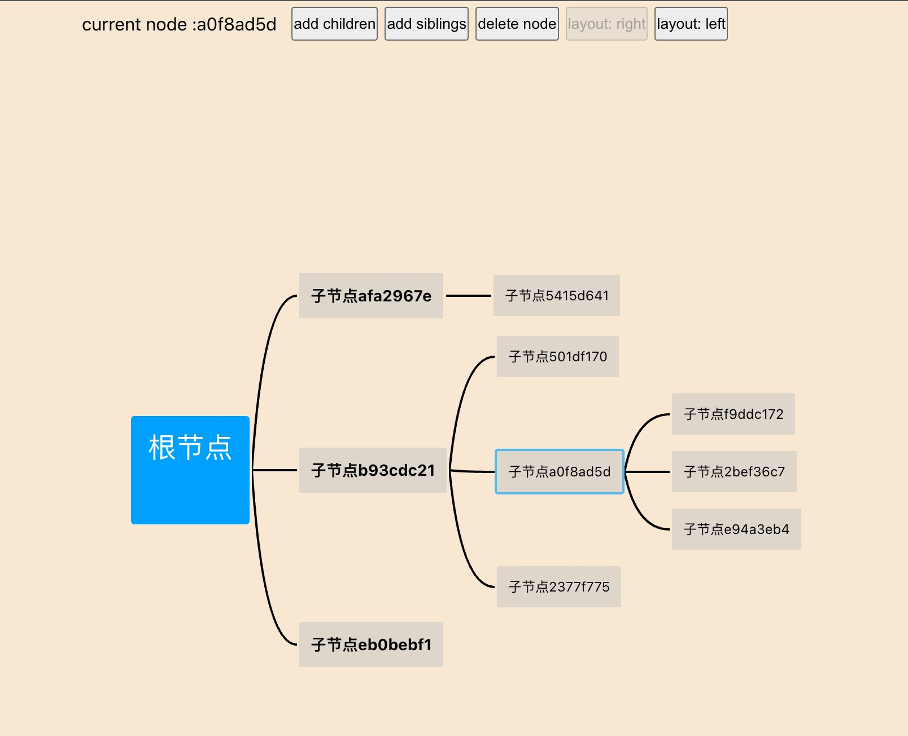

## react-xmind

一个简单的用于理解自定义布局算法的思维导图。

## Example

在线 demo : [https://react-xmind.vercel.app/](https://react-xmind.vercel.app/)



## Run

```js

git clone https://github.com/buynao/react-xmind.git

cd react-xmind

npm install & yarn
npm run dev & yarn dev

```
